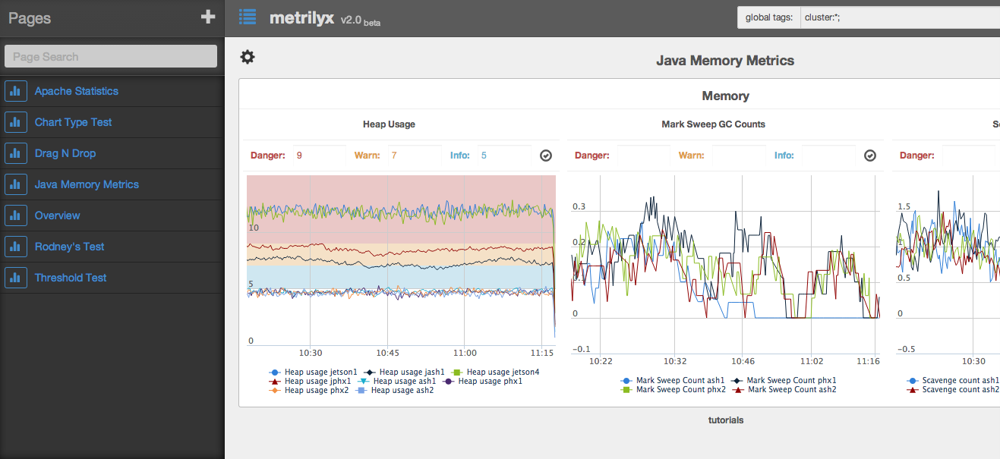
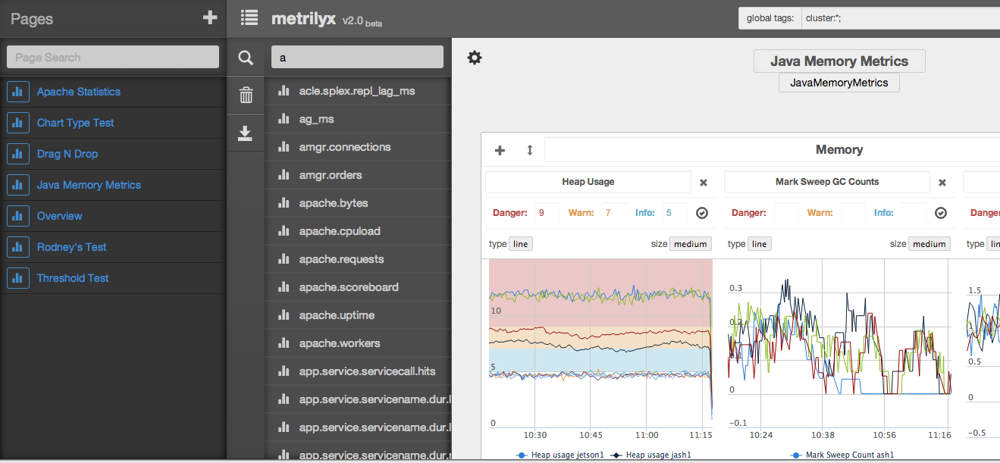

metrilyx-2.0
============

#### Overview

#### Page listing

#### Edit Mode

Metrilyx is a web based dashboard engine  to OpenTSDB, a time series database used to store large amounts of data.  It allows for analyzing, cross cutting and viewing of time series data in a simple manner.
 
### Requirements
Metrilyx will run on any system that supports the packages below.  It has primarily been tested on RedHat based flavors of Linux.

##### OS Packages:
RHEL:
	libuuid
	uuid
	httpd
	mod_wsgi
	python-setuptools
	
Debian:
	libuuid1 
	uuid-runtime 
	apache2-mpm-worker 
	libapache2-mod-wsgi 
	make 
	python-setuptools

##### Python Packages:
	Django
	django-filter
	Markdown
	djangorestframework
	uuid

### Installation
The provided makefile will work with **RedHat** based distributions.  You can issue the command below, to auto-install the complete package including dependencies. The default install path is **/opt/metrilyx**.	
	
	[</path/to/downloaded/app>]$ bash install.sh
	

This will install all required OS packages as well as python packages and apache configs. 

For **other distributions**, follow the instructions below:

	- Install the required OS packages based on your OS's package manager.
	
	- [</path/to/downloaded/app>]$ make pydeps
	
	- Copy etc/httpd/conf.d/metrilyx.conf to your webservers config directory.
	
	- Set the permissions to /opt/metrilyx to the appropriate web user 

	- Edit the configuration (more below).

	- Restart the webserver.

### Configuration
The default installation directory is /opt/metrilyx (i.e %{metrilyx_home}).

##### Path 
%{metrilyx_home}/etc/metrilyx/metrilyx.conf

A sample config file is provided in the same directory above.  The configuration file is in JSON format.  To begin you can copy the sample config to the path mentioned above and fill in the uri and port.
	
	{
		"tsdb": {
			"uri":"tsdb.example.com",
			"port": 80
		},
		"model_path": <absolute path to models directory>
	}
	
##### tsdb.uri
OpenTSDB http host

##### tsdb.port
OpenTSDB http Port (default: 80)

##### model_path
Path to directory where JSON page models (i.e. dashboards) will be stored.  Optional (default: %{metrilyx_home}/pagemodels)

#### Notes
- The default username and password for the site are admin and password respectively. These should almost never be required and are specifically needed by the REST interface.
- If you would like to change the password, change to the application installation directory.  Remove the file called **metrilyx.sqlite3** and run **python manage.py syncdb**.  This should prompt you to create a new admin user.  Type 'yes', and follow the prompts to create a new username and password.